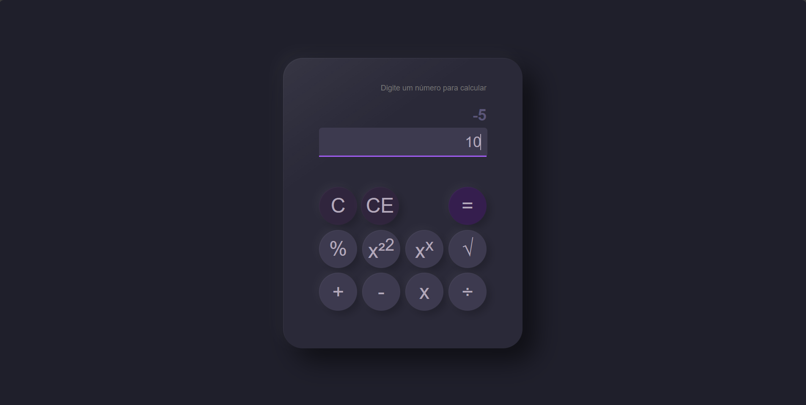

# 🧮 Calculator App (React Basics)

Um projeto de calculadora desenvolvido com React, criado como parte do curso React Basics da Meta (Coursera), com o objetivo de aplicar e consolidar conceitos fundamentais do desenvolvimento frontend moderno.

# 🚀 Sobre o projeto
Este projeto consiste em uma calculadora funcional que realiza operações matemáticas básicas e avançadas, com interface moderna e responsiva.

O principal objetivo foi praticar os conceitos essenciais do React, como:

Componentização
Props
State (useState)
Manipulação de eventos
Renderização condicional
Estrutura de projetos com Vite

# 🎯 Objetivo de aprendizagem
Este projeto foi desenvolvido com foco em:

Consolidar fundamentos do React
Entender a arquitetura baseada em componentes
Praticar gerenciamento de estado com hooks
Melhorar a organização de código frontend
Aplicar boas práticas de desenvolvimento moderno

# 🧠 Funcionalidades
✔️ Soma
✔️ Subtração
✔️ Multiplicação
✔️ Divisão
✔️ Potência (x^2 e x^x)
✔️ Raiz quadrada
✔️ Porcentagem
✔️ Reset de entrada e resultado
✔️ Interface interativa

# 🛠️ Tecnologias utilizadas
React
JavaScript (ES6+)
Vite
CSS3
HTML5

# 📁 Estrutura do projeto
src/
├── assets/
├── components/
│   └── CalculatorButtons.jsx
├── App.jsx
├── App.css
└── main.jsx

# ⚙️ Como executar o projeto
1. Clone o repositório
git clone https://github.com/seu-usuario/seu-repo.git
2. Acesse a pasta
cd seu-repo
3. Instale as dependências
npm install
4. Execute o projeto
npm run dev

# 📚 Aprendizados
Durante o desenvolvimento deste projeto, foram praticados conceitos importantes do ecossistema React, como:

Criação de componentes reutilizáveis
Comunicação entre componentes via props
Controle de estado com useState
Manipulação de eventos do usuário
Estruturação de projeto com Vite
Organização de código frontend

# 📸 Preview

# 📌 Status do projeto
✔️ Concluído (versão de aprendizado)

# 👨‍💻 Autor
Clara Carolina
Desenvolvido como parte do curso React Basics – Meta (Coursera).

# 📖 Curso de referência
React Basics
https://www.coursera.org/learn/react-basics

# ⭐ Observação final
Este projeto faz parte do processo de aprendizado e evolução em desenvolvimento frontend, com foco em boas práticas e fundamentos sólidos do React.